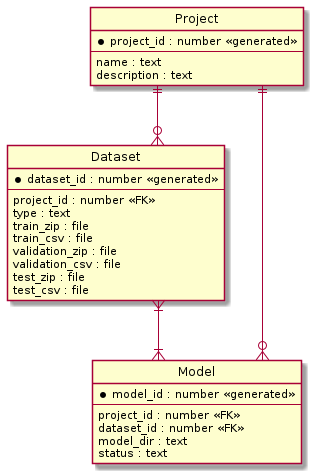
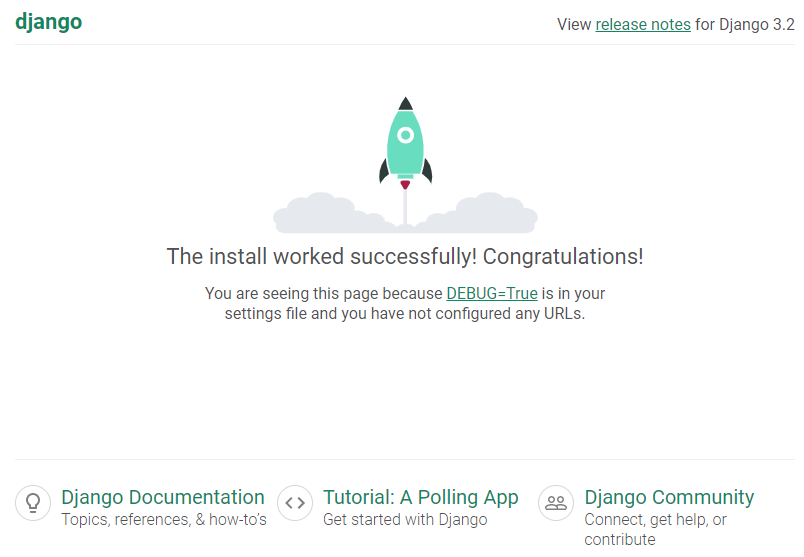
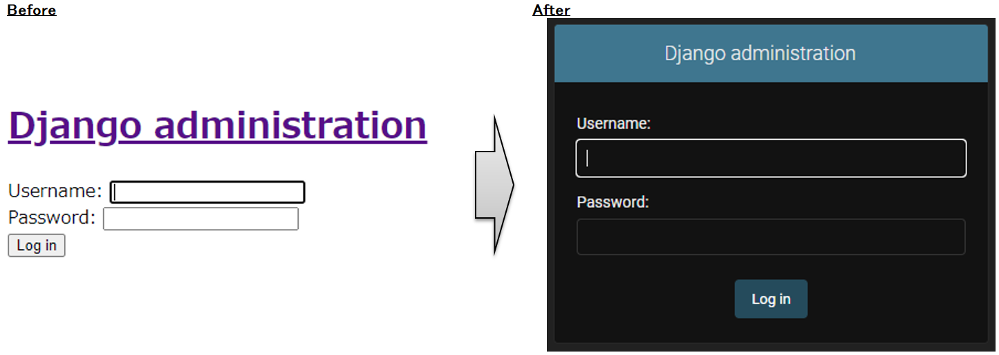

# AI Dashboard (開発中)

機械学習の実行にPythonを使用する為，WebアプリケーションにはDjangoを使用することとした．  
WebサーバにはダウンしにくいといわれるNginxを，Djangoとの接続には推奨されている(らしい)Gunicornを使用する．  
機械学習ではデータセットやモデルの学習結果，試行錯誤のパターンなど複雑で大量のデータ管理が必要となることから，PostgreSQLを使用する．

# ToDo

ToDoのメモ．思いついたら順次追加する．

* [x] MNIST/CIFAR-10データセットを用いた画像分類モデルの学習
* 学習設定
  * [x] モデルごとの学習パラメータ設定
* 学習中断
  * [x] 中断処理
  * [x] 中断時のステータス更新（MlModel.status, MlModel.training_pid）
* [x] Tensorboard起動及びリンク
* Tensorboard終了
  * [x] 終了処理(プロセスKill)，MlModel.tensorboard_pid更新
* 学習終了処理
  * [x] ステータス更新(MlModel.status, MlModel.training_pid)
* プロジェクト操作
  * [x] 追加
  * [x] 変更
  * [ ] 削除
* MLモデル操作
  * [x] 追加
  * [x] 変更
  * [ ] 削除
* ディレクトリ構造
  * [x] モデルごとの分割
    * モデルごとにディレクトリを分割して結果を保存するように構成する
* データセット操作
  * [x] プリセット(MNIST, CIFAR-10)
  * カスタムデータセット
    * [ ] 追加
    * [ ] 削除
* データセット分析
  * [x] 画像表示
  * [ ] 統計量表示
* ダウンロード
  * [ ] 学習済みモデルのダウンロード(Keras H5)
  * [ ] 学習済みモデルのダウンロード(Saved Model)
  * [ ] 学習済みモデルのダウンロード(TensorFlow Lite)
* 推論
  * [ ] データ指定（単一データの推論）
  * [x] データセット指定（複数データの推論）
* 精度計測
  * [ ] データ指定（単一データの精度計算）
  * [ ] データセット指定（複数データの精度計算）
* モデル構造分析
  * [ ] Netron導入


# 使用方法

## サーバ起動

1. 前準備  
    1. local_settings.py生成  
        ```
        $ source venv/bin/activate
        (venv) $ python3 tools/create_local_settings/create_local_settings.py --output_file django_project/project/local_settings.py
        (venv) $ deactivate
        ```
    1. configファイル生成
        ```
        $ source venv/bin/activate
        (venv) $ $ python3 tools/create_config/create_config.py --output_dir django_project/media/config/
        (venv) $ deactivate
        ```
1. サーバ起動
    1. 下記コマンド実行後，http://localhost:1317/ へアクセスする．  
        ```docker-compose build```から```docker-compose exec web python manage.py collectstatic --no-input```までの手順は```build_and_run.sh```でも代用可．

        ```
        $ git clone https://github.com/ryoma-jp/AI_Dashboard.git
        $ cd AI_Dashboard
        $ docker-compose build
        $ docker-compose up -d
        $ docker-compose exec web python manage.py makemigrations --no-input
        $ docker-compose exec web python manage.py migrate --no-input
        $ docker-compose exec web python manage.py collectstatic --no-input
        ```

## データベース初期化

```docker-compose down -v```でコンテナ削除する際にボリュームも削除する．  
```docker-compose down```ではコンテナは削除されるがボリュームは削除されない為，データベースは維持できる．

### ER図



# 環境構築手順

virtualenv上でDocker-Djangoプロジェクト(ベースツリー)を作成し，これをDocker上で動作するように改変した後，PostgreSQL/Gunicorn/Nginxを設定する流れで環境を構築する．  
構築した後，AI関連アプリケーションを実装するが，本節ではNginxの設定まで完了したベース環境構築手順を記載する．

## 必要なパッケージのインストール

```
$ sudo apt install python3-pip docker-compose
$ sudo -H pip3 install --upgrade pip
$ sudo -H pip3 install virtualenv
```

## virtualenvの有効化とDjangoプロジェクト(ベースツリー)の作成

```
$ virtualenv venv
$ source venv/bin/activate
(venv)$ pip3 install django
(venv)$ cd <path/to/project>
(venv)$ mkdir django_project
(venv)$ cd django_project
(venv)$ django-admin startproject project .
(venv)$ tree .
.
├── manage.py
└── project
     ├── __init__.py
     ├── asgi.py
     ├── settings.py
     ├── urls.py
     └── wsgi.py
(venv)$ deactivate
```

### 参考1) サーバ起動と動作確認

下記コマンドでサーバを立ち上げて，http://localhost:8000 へアクセスしロケットを確認

```
(venv)$ python3 manage.py runserver
```




### 参考2) virtualenvの無効化

```
(venv)$ deactivate
```

### 参考3) 実行ログの確認方法

#### フロントエンド

* ブラウザの検証機能（Google Chrome）や調査機能（Firefox）からコンソールを開く

#### バックエンド

```
$ docker-compose logs -f <コンテナ名>
```

## Docker上で上記Djangoプロジェクトのサーバを起動する

Dockerfile，requirements.txt，docker-compose.yml，.env.devの作成とsettings.pyの編集を行う．  
編集後，```docker-compose build``` → ```docker-compose up -d```でサーバを起動し，http://localhost:8000 へアクセスしロケットを確認する．  

```
$ cd <path/to/project>/django_project
$ touch Dockerfile
$ touch requirements.txt
$ cd ..
$ touch docker-compose.yml
$ touch .env.dev
$ vim django_project/project/settings.py
$ docker-compose build
$ docker-compose up -d
Creating network "ai_dashboard_default" with the default driver
Creating ai_dashboard_web_1 ... done
$ docker-compose ps
       Name                     Command               State                    Ports
------------------------------------------------------------------------------------------------------
ai_dashboard_web_1   python manage.py runserver ...   Up      0.0.0.0:8000->8000/tcp,:::8000->8000/tcp
```

### Dockerfileの中身

```
FROM python:3.9.7-alpine

WORKDIR /usr/src/app

ENV PYTHONDONTWRITEBYTECODE 1
ENV PYTHONUNBUFFERED 1

RUN pip install --upgrade pip
COPY ./requirements.txt .
RUN pip install -r requirements.txt

COPY . .
```

### requirements.txtの中身

```
Django
```

### docker-compose.ymlの中身

```
version: '3.7'

services:
  web:
    build: ./django_project
    command: python manage.py runserver 0.0.0.0:8000
    volumes:
      - ./django_project/:/usr/src/app/
    ports:
      - 8000:8000
    env_file:
      - ./.env.dev
```

### .env.devの中身

```
DEBUG=True
SECRET_KEY=xxxxxxxxxxxxxxxxxxxx
ALLOWED_HOSTS=localhost 127.0.0.1 [::1]
```

### django_project/project/settings.pyの編集内容

```
@@ -10,6 +10,7 @@ For the full list of settings and their values, see
 https://docs.djangoproject.com/en/3.2/ref/settings/
 """

+import os
 from pathlib import Path

 # Build paths inside the project like this: BASE_DIR / 'subdir'.
@@ -20,12 +21,12 @@ BASE_DIR = Path(__file__).resolve().parent.parent
 # See https://docs.djangoproject.com/en/3.2/howto/deployment/checklist/

 # SECURITY WARNING: keep the secret key used in production secret!
-SECRET_KEY = 'django-insecure-t!n-cng*3f*lnv1-jd-vmfd$_#p*#rpw!pruere(4d2!h$5_2n'
+SECRET_KEY = os.environ.get("SECRET_KEY")

 # SECURITY WARNING: don't run with debug turned on in production!
-DEBUG = True
+DEBUG = os.environ.get("DEBUG")

-ALLOWED_HOSTS = []
+ALLOWED_HOSTS = os.environ.get("ALLOWED_HOSTS").split(" ")
```

### 参考1) 起動したサーバの終了方法

```
$ docker-compose down
Stopping ai_dashboard_web_1 ... done
Removing ai_dashboard_web_1 ... done
Removing network ai_dashboard_default
```

### 参考2) Docker環境構築時点のディレクトリ構成

```
$ cd <path/to/project>
$ tree .
.
├── django_project
│   ├── Dockerfile
│   ├── manage.py
│   ├── project
│   │   ├── __init__.py
│   │   ├── asgi.py
│   │   ├── settings.py
│   │   ├── urls.py
│   │   └── wsgi.py
│   └── requirements.txt
└── docker-compose.yml
```

## PostgreSQLを設定する

```
$ cd <path/to/project>
$ vim .env.dev
$ vim docker-compose.yml
$ vim django_project/Dockerfile
$ vim django_project/requirements.txt
$ vim django_project/project/settings.py
$ docker-compose build
$ docker-compose up -d
$ docker-compose ps
       Name                     Command               State                    Ports
------------------------------------------------------------------------------------------------------
ai_dashboard_db_1    docker-entrypoint.sh postgres    Up      5432/tcp
ai_dashboard_web_1   python manage.py runserver ...   Up      0.0.0.0:8000->8000/tcp,:::8000->8000/tcp
$ docker-compose exec web python manage.py migrate --no-input
Operations to perform:
  Apply all migrations: admin, auth, contenttypes, sessions
Running migrations:
  Applying contenttypes.0001_initial... OK
  Applying auth.0001_initial... OK
  Applying admin.0001_initial... OK
  Applying admin.0002_logentry_remove_auto_add... OK
  Applying admin.0003_logentry_add_action_flag_choices... OK
  Applying contenttypes.0002_remove_content_type_name... OK
  Applying auth.0002_alter_permission_name_max_length... OK
  Applying auth.0003_alter_user_email_max_length... OK
  Applying auth.0004_alter_user_username_opts... OK
  Applying auth.0005_alter_user_last_login_null... OK
  Applying auth.0006_require_contenttypes_0002... OK
  Applying auth.0007_alter_validators_add_error_messages... OK
  Applying auth.0008_alter_user_username_max_length... OK
  Applying auth.0009_alter_user_last_name_max_length... OK
  Applying auth.0010_alter_group_name_max_length... OK
  Applying auth.0011_update_proxy_permissions... OK
  Applying auth.0012_alter_user_first_name_max_length... OK
  Applying sessions.0001_initial... OK
$ docker-compose exec db psql --username=user_name --dbname=db_name
psql (13.4)
Type "help" for help.

db_name=# \l
                                  List of databases
   Name    |   Owner   | Encoding |  Collate   |   Ctype    |    Access privileges
-----------+-----------+----------+------------+------------+-------------------------
 db_name   | user_name | UTF8     | en_US.utf8 | en_US.utf8 |
 postgres  | user_name | UTF8     | en_US.utf8 | en_US.utf8 |
 template0 | user_name | UTF8     | en_US.utf8 | en_US.utf8 | =c/user_name           +
           |           |          |            |            | user_name=CTc/user_name
 template1 | user_name | UTF8     | en_US.utf8 | en_US.utf8 | =c/user_name           +
           |           |          |            |            | user_name=CTc/user_name
(4 rows)
```

### .env.dev編集内容

```
@@ -2,3 +2,13 @@ DEBUG=True
 SECRET_KEY=xxxxxxxxxxxxxxxxxxxx
 ALLOWED_HOSTS=localhost 127.0.0.1 [::1]

+SQL_DATABASE=db_name
+SQL_USER=user_name
+SQL_PASSWORD=password
+SQL_HOST=db
+SQL_PORT=5432
+
+POSTGRES_USER=user_name
+POSTGRES_PASSWORD=password
+POSTGRES_DB=db_name
+
```

### docker-compose.yml編集内容

```
@@ -10,3 +10,18 @@ services:
       - 8000:8000
     env_file:
       - ./.env.dev
+    depends_on:
+      - db
+
+  db:
+    image: postgres:13.4-alpine
+    volumes:
+      - postgres_data:/var/lib/postgresql/data/
+    env_file:
+      - ./.env.dev
+
+volumes:
+  postgres_data:
```

### Dockerfile編集内容

```
@@ -4,7 +4,10 @@ WORKDIR /usr/src/app

 ENV PYTHONDONTWRITEBYTECODE 1
 ENV PYTHONUNBUFFERED 1
-
+
+RUN apk update \
+    && apk add postgresql-dev gcc python3-dev musl-dev
+
 RUN pip install --upgrade pip
 COPY ./requirements.txt .
 RUN pip install -r requirements.txt
```

### requirements.txt編集内容

```
@@ -1,2 +1,3 @@
 Django
+psycopg2-binary
```

### settings.py編集内容

```
@@ -76,8 +76,12 @@ WSGI_APPLICATION = 'project.wsgi.application'

 DATABASES = {
     'default': {
-        'ENGINE': 'django.db.backends.sqlite3',
-        'NAME': BASE_DIR / 'db.sqlite3',
+        'ENGINE': 'django.db.backends.postgresql_psycopg2',
+        'NAME': os.environ.get("SQL_DATABASE"),
+        'USER': os.environ.get("SQL_USER"),
+        'PASSWORD': os.environ.get("SQL_PASSWORD"),
+        'HOST': os.environ.get("SQL_HOST"),
+        'PORT': os.environ.get("SQL_PORT"),
     }
 }
```

## PostgreSQL自動起動スクリプトを追加

```
$ touch django_project/entrypoint.sh
$ vim django_project/Dockerfile
$ vim .env.dev
```

### entrypoint.shの中身

```
#!/bin/sh
 
if [ "$DATABASE" = "postgres" ]
then
    echo "Waiting for postgres..."
 
    while ! nc -z $SQL_HOST $SQL_PORT; do
      sleep 0.1
    done
 
    echo "PostgreSQL started"
fi
 
exec "$@"
```

### Dockerfileの編集内容

```
@@ -14,3 +14,4 @@ RUN pip install -r requirements.txt

 COPY . .

+ENTRYPOINT ["/usr/src/app/entrypoint.sh"]
```

### .env.devの編集内容

```
@@ -12,3 +12,4 @@ POSTGRES_USER=user_name
 POSTGRES_PASSWORD=password
 POSTGRES_DB=db_name

+DATABASE=postgres
```

### PostgreSQL設定後のディレクトリ構成

```
$ cd <path/to/project>
$ tree .
.
├── django_project
│   ├── Dockerfile
│   ├── entrypoint.sh
│   ├── manage.py
│   ├── project
│   │   ├── __init__.py
│   │   ├── asgi.py
│   │   ├── settings.py
│   │   ├── urls.py
│   │   └── wsgi.py
│   └── requirements.txt
└── docker-compose.yml
```

## Gunicornの設定

```
$ cd <path/to/project>
$ vim django_project/requirements.txt
$ vim docker-compose.yml
$ vim django_project/Dockerfile
$ docker-compose build
$ docker-compose up -d
$ docker-compose exec web python manage.py migrate --no-input
```

### requirements.txtの編集内容

```
@@ -1,3 +1,4 @@
 Django
 psycopg2-binary
+gunicorn
```

### docker-compose.ymlの編集内容

```
@@ -3,9 +3,7 @@ version: '3.7'
 services:
   web:
     build: ./django_project
-    command: python manage.py runserver 0.0.0.0:8000
-    volumes:
-      - ./django_project/:/usr/src/app/
+    command: gunicorn project.wsgi:application --bind 0.0.0.0:8000
     ports:
       - 8000:8000
     env_file:
```

### Dockerfileの編集内容

```
@@ -1,4 +1,4 @@
-FROM python:3.9.7-alpine
+FROM python:3.9.7-alpine as builder

 WORKDIR /usr/src/app

@@ -9,9 +9,35 @@ RUN apk update \
     && apk add postgresql-dev gcc python3-dev musl-dev

 RUN pip install --upgrade pip
-COPY ./requirements.txt .
-RUN pip install -r requirements.txt
-
+RUN pip install flake8
 COPY . .

-ENTRYPOINT ["/usr/src/app/entrypoint.sh"]
+COPY ./requirements.txt .
+RUN pip wheel --no-cache-dir --no-deps --wheel-dir /usr/src/app/wheels -r requirements.txt
+
+
+FROM python:3.9.7-alpine
+
+RUN mkdir -p /home/app
+
+RUN addgroup -S app && adduser -S app -G app
+
+ENV HOME=/home/app
+ENV APP_HOME=/home/app/web
+RUN mkdir ${APP_HOME}
+WORKDIR ${APP_HOME}
+
+RUN apk update && apk add libpq
+COPY --from=builder /usr/src/app/wheels /wheels
+COPY --from=builder /usr/src/app/requirements.txt .
+RUN pip install --no-cache /wheels/*
+
+COPY ./entrypoint.sh $APP_HOME
+
+COPY . $APP_HOME
+
+RUN chown -R app:app $APP_HOME
+
+USER app
+
+ENTRYPOINT ["/home/app/web/entrypoint.sh"]
```

## Nginxの設定

下記設定およびデータベースのマイグレートを実行した後，http://localhost:1317/ へアクセスし，ロケットを確認する．  
Nginxへ接続する為，ポート番号は1317となる．

```
$ cd <path/to/project>
$ vim docker-compose.yml
$ mkdir nginx
$ touch nginx/Dockerfile
$ touch nginx/nginx.conf
$ tree .
.
├── django_project
│   ├── Dockerfile
│   ├── entrypoint.sh
│   ├── manage.py
│   ├── project
│   │   ├── __init__.py
│   │   ├── asgi.py
│   │   ├── settings.py
│   │   ├── urls.py
│   │   └── wsgi.py
│   └── requirements.txt
├── docker-compose.yml
└── nginx
    ├── Dockerfile
    └── nginx.conf
$ docker-compose build
$ docker-compose up -d
$ docker-compose exec web python manage.py migrate --no-input
```

### docker-compose.ymlの編集内容

```
@@ -4,8 +4,8 @@ services:
   web:
     build: ./django_project
     command: gunicorn project.wsgi:application --bind 0.0.0.0:8000
-    ports:
-      - 8000:8000
+    expose:
+      - 8000
     env_file:
       - ./.env.dev
     depends_on:
@@ -17,9 +17,14 @@ services:
       - postgres_data:/var/lib/postgresql/data/
     env_file:
       - ./.env.dev
-
-volumes:
-  postgres_data:

+  nginx:
+    build: ./nginx
+    ports:
+        - 1317:80
+    depends_on:
+        - web

+volumes:
+  postgres_data:
```

### nginx/Dockerfileの中身

```
FROM nginx:1.21.3-alpine

RUN rm /etc/nginx/conf.d/default.conf
COPY nginx.conf /etc/nginx/conf.d
```

### nginx/nginx.confの中身

```
upstream project {
    server web:8000;
}

server {

    listen 80;

    location / {
        proxy_pass http://project;
        proxy_set_header X-Forwarded-For $proxy_add_x_forwarded_for;
        proxy_set_header Host $host;
        proxy_redirect off;
    }

}
```

## Static，Mediaファイルの表示設定(Nginx利用)

WebサーバとしてNginxを利用する為，Staticファイルを扱う設定を追加する．  
Staticファイルとはjsやcssなどアプリケーションで処理を行わない静的ファイルで，他のフレームワークではassetsファイルと呼ばれるもの．

表示設定対応前は，adminページ(http://localhost:1317/admin)へアクセスするとcssが反映されておらず，下記対応を実施することによりcssを反映することができる．



※[Mediaファイルの表示設定](https://tomato-develop.com/docker-dockercompose-python-django-postgresql-gunicorn-nginx-how-to-build-development-and-production-environment/#outline_2__6_7)は保留

```
$ cd <path/to/project>
$ vim django_project/project/settings.py
$ vim docker-compose.yml
$ vim Dockerfile
$ vim nginx/nginx.conf
$ docker-compose build
$ docker-compose up -d
$ docker-compose exec web python manage.py migrate --no-input
$ docker-compose exec web python manage.py collectstatic --no-input --clear
```

### django_project/project/settings.pyの編集内容

```
@@ -123,6 +123,7 @@ USE_TZ = True
 # https://docs.djangoproject.com/en/3.2/howto/static-files/

 STATIC_URL = '/static/'
+STATIC_ROOT = os.path.join(BASE_DIR, "static")

 # Default primary key field type
 # https://docs.djangoproject.com/en/3.2/ref/settings/#default-auto-field
```

### docker-compose.ymlの編集内容

```
@@ -4,6 +4,8 @@ services:
   web:
     build: ./django_project
     command: gunicorn project.wsgi:application --bind 0.0.0.0:8000
+    volumes:
+      - static_volume:/home/app/web/static
     expose:
       - 8000
     env_file:
@@ -20,11 +22,13 @@ services:

   nginx:
     build: ./nginx
+    volumes:
+      - static_volume:/home/app/web/static
     ports:
-        - 1317:80
+      - 1317:80
     depends_on:
-        - web
+      - web

 volumes:
   postgres_data:
-
+  static_volume:
```

### Dockerfileの編集内容

```
@@ -25,6 +25,7 @@ RUN addgroup -S app && adduser -S app -G app
 ENV HOME=/home/app
 ENV APP_HOME=/home/app/web
 RUN mkdir ${APP_HOME}
+RUN mkdir ${APP_HOME}/static
 WORKDIR ${APP_HOME}

 RUN apk update && apk add libpq
```

### nginx/nginx.confの編集内容

```
@@ -13,4 +13,8 @@ server {
         proxy_redirect off;
     }

+    location /static/ {
+        alias /home/app/web/static/;
+    }
+
 }
```

## Bootstrapを導入(アプリケーション作成～Hello Worldページの表示)

Bootstrap5アプリケーションを作成し，Hello Worldページを表示する．  
下記の対応後，http://localhost:1317/ へアクセスすると```django_project/html/index.html```の内容が表示される．


```
$ cd <path/to/project>
$ source venv/bin/activate
(venv)$ pip3 install django_bootstrap5 psycopg2-binary
(venv)$ cd django_project/
(venv)$ export ALLOWED_HOSTS="localhost 127.0.0.1 [::1]"
(venv)$ python3 manage.py startapp app
(venv)$ deactivate
$ vim django_project/requirements.txt
$ vim django_project/project/settings.py
$ touch django_project/app/urls.py
$ vim django_project/app/views.py
$ mkdir django_project/html
$ touch django_project/html/index.html
$ docker-compose build
$ docker-compose up -d
$ docker-compose exec web python manage.py migrate --no-input
$ docker-compose exec web python manage.py collectstatic --no-input --clear
```

### django_project/requirements.txtの編集内容

```
@@ -1,4 +1,5 @@
 Django
 psycopg2-binary
 gunicorn
+django-bootstrap5
```

### django_project/project/settings.pyの編集内容

```
@@ -38,6 +38,8 @@ INSTALLED_APPS = [
     'django.contrib.sessions',
     'django.contrib.messages',
     'django.contrib.staticfiles',
+    'django_bootstrap5',
+    'app',
 ]

 MIDDLEWARE = [
@@ -55,7 +57,7 @@ ROOT_URLCONF = 'project.urls'
 TEMPLATES = [
     {
         'BACKEND': 'django.template.backends.django.DjangoTemplates',
-        'DIRS': [],
+        'DIRS': [BASE_DIR, 'html'],
         'APP_DIRS': True,
         'OPTIONS': {
             'context_processors': [
@@ -129,3 +131,75 @@ STATIC_ROOT = os.path.join(BASE_DIR, "static")
 # https://docs.djangoproject.com/en/3.2/ref/settings/#default-auto-field

 DEFAULT_AUTO_FIELD = 'django.db.models.BigAutoField'
+
+
+# Default settings for Bootstrap5
+#  * https://django-bootstrap5.readthedocs.io/en/latest/settings.html
+BOOTSTRAP5 = {
+
+    # The complete URL to the Bootstrap CSS file.
+    # Note that a URL can be either a string
+    # ("https://stackpath.bootstrapcdn.com/bootstrap/4.1.1/css/bootstrap.min.css"),
+    # or a dict with keys `url`, `integrity` and `crossorigin` like the default value below.
+    "css_url": {
+        "url": "https://cdn.jsdelivr.net/npm/bootstrap@5.0.0-beta2/dist/css/bootstrap.min.css",
+        "integrity": "sha384-BmbxuPwQa2lc/FVzBcNJ7UAyJxM6wuqIj61tLrc4wSX0szH/Ev+nYRRuWlolflfl",
+        "crossorigin": "anonymous",
+    },
+
+    # The complete URL to the Bootstrap bundle JavaScript file.
+    "javascript_url": {
+        "url": "https://cdn.jsdelivr.net/npm/bootstrap@5.0.0-beta2/dist/js/bootstrap.bundle.min.js",
+        "integrity": "sha384-b5kHyXgcpbZJO/tY9Ul7kGkf1S0CWuKcCD38l8YkeH8z8QjE0GmW1gYU5S9FOnJ0",
+        "crossorigin": "anonymous",
+    },
+
+    # The complete URL to the Bootstrap CSS theme file (None means no theme).
+    "theme_url": None,
+
+    # Put JavaScript in the HEAD section of the HTML document (only relevant if you use bootstrap5.html).
+    'javascript_in_head': False,
+
+    # Wrapper class for non-inline fields.
+    # The default value "mb-3" is the spacing as used by Bootstrap 5 example code.
+    'wrapper_class': 'mb-3',
+
+    # Wrapper class for inline fields.
+    # The default value is empty, as Bootstrap5 example code doesn't use a wrapper class.
+    'inline_wrapper_class': '',
+
+    # Label class to use in horizontal forms.
+    'horizontal_label_class': 'col-sm-2',
+
+    # Field class to use in horizontal forms.
+    'horizontal_field_class': 'col-sm-10',
+
+    # Field class used for horizontal fields withut a label.
+    'horizontal_field_offset_class': 'offset-sm-2',
+
+    # Set placeholder attributes to label if no placeholder is provided.
+    'set_placeholder': True,
+
+    # Class to indicate required field (better to set this in your Django form).
+    'required_css_class': '',
+
+    # Class to indicate field has one or more errors (better to set this in your Django form).
+    'error_css_class': '',
+
+    # Class to indicate success, meaning the field has valid input (better to set this in your Django form).
+    'success_css_class': '',
+
+    # Enable or disable Bootstrap 5 server side validation classes (separate from the indicator classes above).
+    'server_side_validation': True,
+
+    # Renderers (only set these if you have studied the source and understand the inner workings).
+    'formset_renderers':{
+        'default': 'django_bootstrap5.renderers.FormsetRenderer',
+    },
+    'form_renderers': {
+        'default': 'django_bootstrap5.renderers.FormRenderer',
+    },
+    'field_renderers': {
+        'default': 'django_bootstrap5.renderers.FieldRenderer',
+    },
+}
```

### django_project/project/urls.pyの編集内容

```
@@ -14,8 +14,9 @@ Including another URLconf
     2. Add a URL to urlpatterns:  path('blog/', include('blog.urls'))
 """
 from django.contrib import admin
-from django.urls import path
+from django.urls import path, include

 urlpatterns = [
     path('admin/', admin.site.urls),
+    path('', include('app.urls')),
 ]
```

### django_project/app/urls.pyの中身

```
"""app URL Configuration
"""
from django.urls import path
from . import views

urlpatterns = [
    path('', views.helloworld),
]
```

### django_project/app/views.pyの編集内容

```python3 manage.py startapp app```で生成されたファイルに対して```helloworld()```関数を追加

```
from django.shortcuts import render

# Create your views here.

""" Function: helloworld
 * show hello world
"""
def helloworld(request):
    return render(request, 'index.html')

```

### django_project/html/index.htmlの中身

```
<!DOCTYPE html>
<html lang="ja">
  <head>
    <meta charset="utf-8">
    <title>Hello World</title>
  </head>
  <body>
    <h1>Hello World</h1>
  </body>
</html>
```

## Bootstrapを導入(ダッシュボードの基盤を実装)

Bootstrap5を組み込み，のダッシュボードを実装する．  

```
$ cd <path/to/project>
$ mkdir django_project/static
$ wget https://github.com/twbs/bootstrap/releases/download/v5.1.1/bootstrap-5.1.1-dist.zip
$ unzip bootstrap-5.1.1-dist.zip
$ mv bootstrap-5.1.1-dist/* .
$ wget https://github.com/twbs/bootstrap/releases/download/v5.1.1/bootstrap-5.1.1-examples.zip
$ unzip bootstrap-5.1.1-examples.zip
$ cp bootstrap-5.1.1-examples/dashboard/dashboard.css ./css
$ cp bootstrap-5.1.1-examples/dashboard/dashboard.rtl.css ./css
$ cp bootstrap-5.1.1-examples/dashboard/dashboard.js ./js
$ rm -rf bootstrap-5.1.1-dist.zip bootstrap-5.1.1-dist bootstrap-5.1.1-examples.zip bootstrap-5.1.1-examples
$ cd ../..
$ vim django_project/html/index.html
$ docker-compose build
$ docker-compose up -d
$ docker-compose exec web python manage.py migrate --no-input
$ docker-compose exec web python manage.py collectstatic --no-input
```

### django_project/html/index.htmlの編集内容

```
@@ -1,10 +1,104 @@
-<!DOCTYPE html>
-<html lang="ja">
+
+<!doctype html>
+<html lang="en">
   <head>
+    <!-- Required meta tags -->
     <meta charset="utf-8">
-    <title>Hello World</title>
+    <meta name="viewport" content="width=device-width, initial-scale=1, shrink-to-fit=no">
+
+    <title>AI Dashboard</title>
+
+    <!-- Bootstrap CSS -->
+    <link rel="stylesheet" href="" integrity="sha384-F3w7mX95PdgyTmZZMECAngseQB83DfGTowi0iMjiWaeVhAn4FJkqJByhZMI3AhiU" crossorigin="anonymous">
+
+    <style>
+      .bd-placeholder-img {
+        font-size: 1.125rem;
+        text-anchor: middle;
+        -webkit-user-select: none;
+        -moz-user-select: none;
+        user-select: none;
+      }
+
+      @media (min-width: 768px) {
+        .bd-placeholder-img-lg {
+          font-size: 3.5rem;
+        }
+      }
+    </style>
+
+    <!-- Custom styles for this template -->
+    <link rel="stylesheet" href="" integrity="sha384-uSR7v2VdvfbsRXqhlUwWi9MQ8uLJCIUVMahQVKO5l18MW4BLJry2KDS7/S8Rlmcn" crossorigin="anonymous">
   </head>
+
   <body>
-    <h1>Hello World</h1>
+    <!-- Header -->
+    <header class="navbar navbar-dark sticky-top bg-dark flex-md-nowrap p-0 shadow">
+      <a class="navbar-brand col-md-3 col-lg-2 me-0 px-3" href="#">AI Dashboard</a>
+      <button class="navbar-toggler position-absolute d-md-none collapsed" type="button" data-bs-toggle="collapse" data-bs-target="#sidebarMenu" aria-controls=...skipping...
+                  Home
+                </a>
+              </li>
+              <li>
+                <a href="#" class="nav-link text-white" data-bs-toggle="tab" data-bs-target="#dataset">
+                  <svg xmlns="http://www.w3.org/2000/svg" width="16" height="16" fill="currentColor" class="bi bi-cloud-upload" viewBox="0 0 16 16">
+                    <path fill-rule="evenodd" d="M4.406 1.342A5.53 5.53 0 0 1 8 0c2.69 0 4.923 2 5.166 4.579C14.758 4.804 16 6.137 16 7.773 16 9.569 14.502 11 12.687 11H10a.5.5 0 0 1 0-1h2.688C13.979 10 15 8.988 15 7.773c0-1.216-1.02-2.228-2.313-2.228h-.5v-.5C12.188 2.825 10.328 1 8 1a4.53 4.53 0 0 0-2.941 1.1c-.757.652-1.153 1.438-1.153 2.055v.448l-.445.049C2.064 4.805 1 5.952 1 7.318 1 8.785 2.23 10 3.781 10H6a.5.5 0 0 1 0 1H3.781C1.708 11 0 9.366 0 7.318c0-1.763 1.266-3.223 2.942-3.593.143-.863.698-1.723 1.464-2.383z"/>
+                    <path fill-rule="evenodd" d="M7.646 4.146a.5.5 0 0 1 .708 0l3 3a.5.5 0 0 1-.708.708L8.5 5.707V14.5a.5.5 0 0 1-1 0V5.707L5.354 7.854a.5.5 0 1 1-.708-.708l3-3z"/>
+                  </svg>
+                  Dataset
+                </a>
+              </li>
+            </ul>
+          </div>
+        </nav>
+
+        <!-- Main -->
+        <main class="col-md-9 ms-sm-auto col-lg-10 px-md-4">
+          <div class="tab-content">
+            <div id="home" class="tab-pane active">
+              <div class="d-flex justify-content-between flex-wrap flex-md-nowrap align-items-center pt-3 pb-2 mb-3 border-bottom">
+                <h1 class="h2">Home</h1>
+              </div>
+              Welcome to AI Dashboard!
+            </div>
+            <div id="dataset" class="tab-pane">
+              <div class="d-flex justify-content-between flex-wrap flex-md-nowrap align-items-center pt-3 pb-2 mb-3 border-bottom">
+                <h1 class="h2">Dataset</h1>
+              </div>
+              <h1 class="h3">Select your dataset</h1>
+              <div class="d-flex mb-3">
+                <input class="form-control" name="userfile" type="file" id="uploadDataset">
+                <button type="submit" class="btn btn-primary ms-4">Upload</button>
+              </div>
+            </div>
+          </div>
+        </main>
+      </div>
+    </div>
+
+    <script src="" integrity="sha384-/bQdsTh/da6pkI1MST/rWKFNjaCP5gBSY4sEBT38Q/9RBh9AH40zEOg7Hlq2THRZ" crossorigin="anonymous"></script>
   </body>
+
 </html>
```

## 環境構築手順まとめ

環境構築手順の解説は以上とする．  
Bootstrap5の機能を使用してサイドメニューの作成と画面遷移するところまでを紹介した．  
以降はアプリケーションに必要な機能を適宜実装する．

# Reference

## Webアプリケーション開発概要

* [Webアプリケーション開発におけるフロントエンド、バックエンド分離環境](https://qiita.com/thetsuthetsu/items/46f971d9040ac3127180)
* [0からREST APIについて調べてみた](https://qiita.com/masato44gm/items/dffb8281536ad321fb08)
* [REST API とは](https://www.redhat.com/ja/topics/api/what-is-a-rest-api)
* [Webアプリケーション](https://view-s.co.jp/product/webapp/concept/)

## Bootstrap

* [Build fast, responsive sites with Bootstrap](https://getbootstrap.com/)
  * [twbs/bootstrap](https://github.com/twbs/bootstrap)
    * MIT License
  * [Select (セレクトメニュー)](https://getbootstrap.jp/docs/5.0/forms/select/)
  * [JQuery の利用](https://getbootstrap.jp/docs/5.0/getting-started/javascript/#jquery-%E3%81%AE%E5%88%A9%E7%94%A8)
* [Bootstrapの使い方を入門者向けにわかりやすく紹介！ダウンロード方法やグリッドシステムについても解説！](https://agency-star.co.jp/column/bootstrap)
* [Bootstrap Icons](https://icons.getbootstrap.com/)
* [Bootstrap Icons v1.5.0](https://github.com/twbs/icons/releases/tag/v1.5.0)
* [SVG入門](https://euske.github.io/euskecs/lec_svg/index.html)
* [Bootstrapのファイルをアップロードするボタンを標準デザインのボタンにする](https://qiita.com/zoonaka/items/46d44793827920282f75)
* [BOOTSTRAP SIDEBAR](https://bootstrapious.com/p/bootstrap-sidebar)
* [Bootstrapのよく使うクラスまとめておいた！！！！](https://qiita.com/nakanishi03/items/c80a16b9b9796c25f890)
* [Bootstrap4を使ってWebページにタブを実装する方法](https://www.fenet.jp/dotnet/column/tool/1770/)
* [最新版で学ぶBootstrap 4入門 タブの作り方](https://ics.media/entry/190826/)
* [Navs and tabs](https://getbootstrap.com/docs/5.1/components/navs-tabs/)
* [Form controls](https://getbootstrap.com/docs/5.1/forms/form-control/)
* [get／postでフォームから送信された値をPHPで受け取る「定義済みの変数」](https://atmarkit.itmedia.co.jp/ait/articles/1407/02/news038.html)
* [Bootstrapの基本をおさえよう (1/5)](https://www.tuyano.com/index3?id=5649391675244544)
* [bootstrap-selectで作ったセレクトボックスを活性化できないときの対応方法](https://qiita.com/ponsuke0531/items/25d52ce55a93d44e59de)
* [Bootstrap 3からBootstrap 5に移行してみた](https://qiita.com/poruruba/items/bf16cd7c71077792ebe3)
* [Bootstrap のタブメニューを Cookie に保存して記憶させる方法](https://www.webantena.net/bootstrap/tab-jquery-cookie/)
* [[Rails6] Bootstrap5 を jQuery無しで導入する](https://qiita.com/tsuchiya_2/items/3ddc25c9b92cb66d9cd6)
* [How to keep the current tab active on page reload in Bootstrap](https://www.tutorialrepublic.com/faq/how-to-keep-the-current-tab-active-on-page-reload-in-bootstrap.php)

## jQuery

* [jQuery](https://jquery.com/)
  * [License](https://jquery.org/license/)
    * MIT License
* [JavaScriptからjQueryへの第一歩](https://qiita.com/maroKanatani/items/26380587dcb78a589951)
* [jQueryの書き方-基本](https://qiita.com/m11ko/items/dec35c6e4ca5449abae1)
* [jQueryでのchangeメソッドとは？changeメソッドの使い方について紹介](https://www.fenet.jp/dotnet/column/%E6%9C%AA%E5%88%86%E9%A1%9E/6656/)

## Docker

* [Docker runでportオプション（-p 8080:8080）や-dオプションする意味～初心者向けにコマンドの解説～](https://qiita.com/hirokihello/items/69df88ba55125c2aed39)
* [Dockerfile書くときに意識してること](https://zenn.dev/esaka/articles/cae40a30bbbfa495e6a9)

## Nginx

* [nginx](https://nginx.org/en/)
* [Official build of Nginx](https://hub.docker.com/_/nginx)
* [Docker入門 Nginxを動かしてみる](https://qiita.com/mtakehara21/items/d7be42cf12772f3ada25)
* [nginxについてまとめ(Appサーバ編)](https://qiita.com/morrr/items/c91aea24327d67f47cdd)
* [PythonかければWebアプリぐらい作れる。](https://qiita.com/cabernet_rock/items/852fc7c5d382fdc422a3)
* [Nginx + uWSGI + Flaskによるwebアプリの構築](https://zenn.dev/shota_imazeki/books/7a0f8e2f4cccd846fb16/viewer/717e178159909f8c12e5)
* [nginx-upload-module](https://www.nginx.com/resources/wiki/modules/upload/)
  * [GitHub](https://github.com/vkholodkov/nginx-upload-module)
* [Djangoの環境をDocker化する（Docker + Django + Gunicorn + nginx）その１](https://qiita.com/amazipangu/items/bce228f506f894cd825d)
  * [Djangoの環境をDocker化する（Docker + Django + Gunicorn + nginx）その2](https://qiita.com/amazipangu/items/1d17e4fb99869d82f438)
  * [Djangoの環境をDocker化する（Docker + Django + Gunicorn + nginx）その3](https://qiita.com/amazipangu/items/f34537b2d4e69db752c4)
* [Docker-composeでDjango開発環境構築+Nginx+uWSGI+MariaDB（macOS編）](https://qiita.com/dalchan/items/4488ecb1ee7669ab6301)
* [DockerでReact＋Django+Nginx＋MySQLの環境構築](https://qiita.com/greenteabiscuit/items/c40ba038703c9f33499b)

## Django

* [django](https://www.djangoproject.com/)
  * [BSD License](https://www.djangoproject.com/download/)
  * [Django documentation](https://docs.djangoproject.com/)
    * [Model field reference](https://docs.djangoproject.com/en/3.2/ref/models/fields/)
* [クィックスタート: Compose と Django](https://docs.docker.jp/compose/django.html)
* [【Djangoの本番環境構築】Ubuntu20.04,Python3.8,Nginx,Gunicorn,PostgreSQL](https://tomato-develop.com/django-ubuntu-python-nginx-gunicorn-postgresql/)
* [【Docker(Docker-Compose)】Python,Djangoの開発・本番環境構築【Postgres,Gunicorn,Nginx利用】](https://tomato-develop.com/docker-dockercompose-python-django-postgresql-gunicorn-nginx-how-to-build-development-and-production-environment/)
* [Django staticファイル まとめ](https://qiita.com/okoppe8/items/38688fa9259f261c9440)
* [django-bootstrap5](https://pypi.org/project/django-bootstrap5/)
* [DjangoでHello Worldアプリの作成手順](https://qiita.com/frosty/items/e545c6258672d88b7707)
* [【Python】DjangoでBootstrapの導入とベーステンプレートの解説](https://prcmyself.com/first-django-step-2)
* [[Django] ファイルアップロード機能の使い方 [基本設定編]](https://qiita.com/okoppe8/items/86776b8df566a4513e96)
* [【Django】 csrf_tokenの仕組みとCSRF無効化・画面カスタマイズする方法](https://djangobrothers.com/blogs/django_csrf/)
* [アップロードした複数ファイルをviews.pyで取得する方法](https://office54.net/python/django/upload-files-getlist)
* [ファイルアップロード機能の実装（前編）](https://www.techpit.jp/courses/27/curriculums/28/sections/242/parts/837)
* [DjangoでCSVアップロード～db登録～バリデーションの機能を作る](https://qiita.com/YoshitakaOkada/items/bfa0617bd3633e1dcced)
* [Django、フォームの表示方法まとめ](https://blog.narito.ninja/detail/98/)
* [Djangoシェルでデータベースを確認しよう](https://paiza.jp/works/django/primer/beginner-django2/8502)
* [Docker+DjangoでPostgreSQLを使う](https://qiita.com/keita_gawahara/items/59a7db6046016046f0dc)
* [docker-composeで「nginx+Django+postgreSQL」を立ち上げる](https://create-it-myself.com/know-how/construct-nginx-django-posgresql-by-docker-compose/)
* [DockerでDjangoの開発環境を作成する（Quickstart: Compose and DjangoのMySQL版）](https://aoishi.hateblo.jp/entry/2017/11/05/153341)
* [Djangoでのファイルアップロード](https://nmomos.com/tips/2019/06/28/django-file-upload/)
  * [mila411/django-fileupload](https://github.com/mila411/django-fileupload)
* [Django マイグレーションの状態を初期化・リセットする](https://zukucode.com/2020/08/django-migrate-reset.html)
* [【Python】Django - プルダウンのフォームを作る](https://maximonelson49.hatenablog.com/entry/2018/09/08/205602)
* [Djangoで、Class-based generic views + ModelForm を使ってみた](https://thinkami.hatenablog.com/entry/2016/01/15/001903)
* [1-16. FormとHTMLレンダリングの関係を理解する](https://django.kurodigi.com/form_html/)
* [Djangoのモデルでchoicesを使用した値をtemplateで表示したい場合](https://qiita.com/naohide_a/items/49eba7969bf841cbba3d)
  * 選択したアイテムをtemplateで表示する(choicesのリストではない)
* [How can i add a onchange js event to Select widget in Django?](https://stackoverflow.com/questions/46124531/how-can-i-add-a-onchange-js-event-to-select-widget-in-django/47103348)
* [django dropdownlist onchange submission](https://stackoverflow.com/questions/16076420/django-dropdownlist-onchange-submission)
* [Filtered Menus in Django](https://djangosteps.wordpress.com/2012/01/12/filtered-menus-in-django/)
* [セレクトボックスを選択したらサブミット](https://qiita.com/act823/items/3a203f1f96e7fe52f69d)
* [How to get form fields' id in Django](https://stackoverflow.com/questions/3763423/how-to-get-form-fields-id-in-django)
* [JavaScriptで書く「var,let,const」の違いと使い分け方法](https://techacademy.jp/magazine/14872)
  * varは関数スコープ
  * let, constはブロックスコープ
  * letは再代入が可能でconstは再代入不可
* [JavaScriptで選択項目を選択した状態に設定する方法を現役エンジニアが解説【初心者向け】](https://techacademy.jp/magazine/22795)
* [How can i add a onchange js event to Select widget in Django?](https://stackoverflow.com/questions/46124531/how-can-i-add-a-onchange-js-event-to-select-widget-in-django/47103348)
* [Djangoの開発環境でiframeが表示されない（127.0.0.1から接続を拒否される）](https://qiita.com/lukapla/items/176ec2b1d34d0b0ebbd3)
  * [X-Frame-Options](https://developer.mozilla.org/en-US/docs/Web/HTTP/Headers/X-Frame-Options)
    * X_FRAME_OPTIONS='ALLOW'は廃止されていて，SAMEORIGINを使用する
* [Djangoで複数ファイル（画像）のプレビューとアップロード](https://hodalog.com/preview-and-upload-images-in-django/)
* [Django逆引きチートシート（QuerySet編）](https://qiita.com/uenosy/items/54136aff0f6373957d22)
* [Django データベース操作 についてのまとめ](https://qiita.com/okoppe8/items/66a8747cf179a538355b)
* [【django】モデルのフィールドについて：フィールドの型・オプション一覧](https://office54.net/python/django/model-field-options)
* [【Django】モデルフィールド：オプションnullとblankの違いについて](https://office54.net/python/django/null-blank-difference)
* [DjangoのSECRET_KEYをバージョン管理対象外にする](https://qiita.com/haessal/items/abaef7ee4fdbd3b218f5)
* [Django プロジェクトの settings.py に定義された変数を利用する](https://qiita.com/mizoe@github/items/da10fa3312545356c099)

## HTML

* [Subresource Integrity](https://developer.mozilla.org/ja/docs/Web/Security/Subresource_Integrity)
  * SRIハッシュの生成方法  
  ```
  $ cat FILENAME.js | openssl dgst -sha384 -binary | openssl base64 -A
  ```
* [iframeを使って画面遷移なしでフォーム送信する方法](https://produce-web.net/sendform-iframe/)
* [input type=”file”で選択できるファイルの拡張子を制限する方法](https://webbibouroku.com/Blog/Article/html5-file-accept)

## JavaScript

* [【10分でマスター】onChangeでフォームの項目をコントロールしよう](https://www.sejuku.net/blog/25060)
* [JavaScript チェックボックスの値を取得/設定する](https://itsakura.com/js-checkbox)
* [JavaScriptの無名関数について現役エンジニアが解説【初心者向け】](https://techacademy.jp/magazine/35133)
* [JavaScriptで即時関数を使う理由](https://qiita.com/katsukii/items/cfe9fd968ba0db603b1e)

## データベース

* [PostgreSQL vs MySQL: その違いとは](https://www.xplenty.com/jp/blog/postgresql-vs-mysql-which-one-is-better-for-your-use-case-ja/)
* [Docker で作る postgres 環境](https://crudzoo.com/blog/docker-postgres)
* [日本PostgreSQLユーザ会](https://www.postgresql.jp/)
  * [PostgreSQLクライアントアプリケーション](https://www.postgresql.jp/document/13/html/reference-client.html)
* [MySQLとPostgreSQLコマンド比較表](https://qiita.com/aosho235/items/c657e2fcd15fa0647471)
  * ``` docker-compose exec db /bin/bash```でデータベースコンテナに接続し，```psql --username=user_name --dbname=db_name```で起動
* [PostgreSQLの基本的なコマンド](https://qiita.com/H-A-L/items/fe8cb0e0ee0041ff3ceb)

## Tensorflow / Keras

* [Keras: release memory after finish training process](https://stackoverflow.com/questions/51005147/keras-release-memory-after-finish-training-process/52354943)

## その他

### GitHubのMarkdownにPlantUMLを表示する方法

Markdownにコードを記述しても図に変換されない．  
PlantUML公式の[オンラインのWebサービス](http://www.plantuml.com/plantuml)を利用すると，画像を返すデコード用URLを取得可能だが，Markdownにコードを記述しない為，差分管理ができない．  
PlantUMLに関してはGitLabの方が便利かもしれない([PlantUML and GitLab](https://docs.gitlab.com/ee/administration/integration/plantuml.html))．

* [GitHub の Markdown (GFM) でPlantUMLを表示するChrome拡張](https://dev.classmethod.jp/articles/chrome-extension-plantuml-in-github-markdown/)
* [GitHubのREADME.mdにシーケンス図を埋め込む](https://qiita.com/takke/items/86a5ddf145cf9693b6e9)
* [PlantUML Server](https://plantuml.com/ja/server)

### docker-composeでGPUを有効にする方法

* [Enabling GPU access with Compose](https://docs.docker.com/compose/gpu-support/)
* [docker-composeでgpuを使う方法](https://qiita.com/hgoj/items/1ba050c7d73e0dd5ef90)

### docker-composeの更新

```
$ which docker-compose
/usr/bin/docker-compose
$ sudo apt remove docker-compose
$ sudo curl -L "https://github.com/docker/compose/releases/download/1.29.2/docker-compose-Linux-x86_64" -o /usr/local/bin/docker-compose
$ sudo chmod +x /usr/local/bin/docker-compose
$ sudo ln -s /usr/local/bin/docker-compose /usr/bin/docker-compose
```

* [【Docker】docker-compose を最新版にアップグレードする](https://qiita.com/kottyan/items/c892b525b14f293ab7b3)
